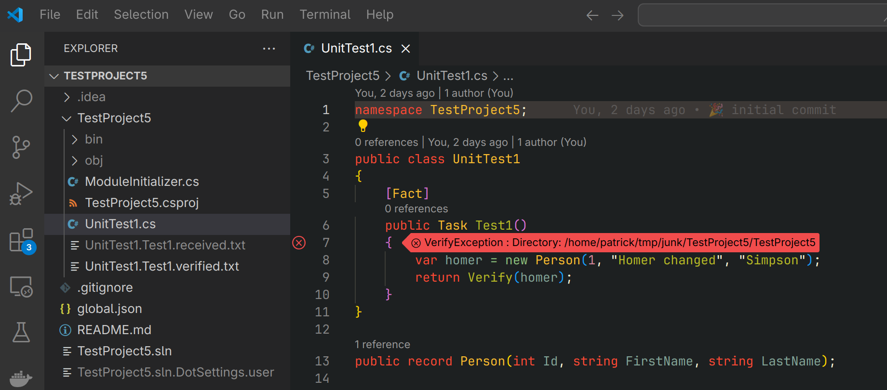
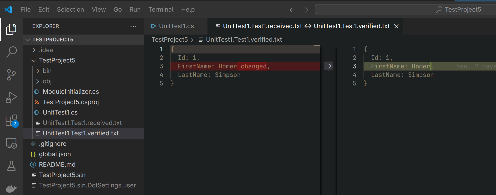

# Minimal Verify Example

Useful for IDE tests...

## Prerequisites

- .NET 8
- VsCode
- VsCode Extensions: C# Dev Kit

## Question about VsCode usage

When executing the ["Test1" in UnitTest1.cs](./TestProject5/UnitTest1.cs) in VsCode,

I expect that the failing test opens the VsCode diff viewer,

because it is defined in [`ModuleInitializer.cs`](./TestProject5/ModuleInitializer.cs).

### On Linux

...this works as expected.

### On Windows

- the diff viewer is opened when running `dotnet test` from the cli
- the diff viewer is **not opened** when running the test from within VsCode

The last bullet point is the part I don't understand...

VsCode on Windows is installed here:

```sh
$ which code
/c/Program Files/Microsoft VS Code/bin/code
```

## Expected behaviour

The following 2 screenshots show the expected behaviour of VsCode on Linux.



Clicking on the red cross symbol to the left of line 7 in the above screenshot opens the VsCode diff viewer:



The diff viewer is not openend on Windows. 😥
